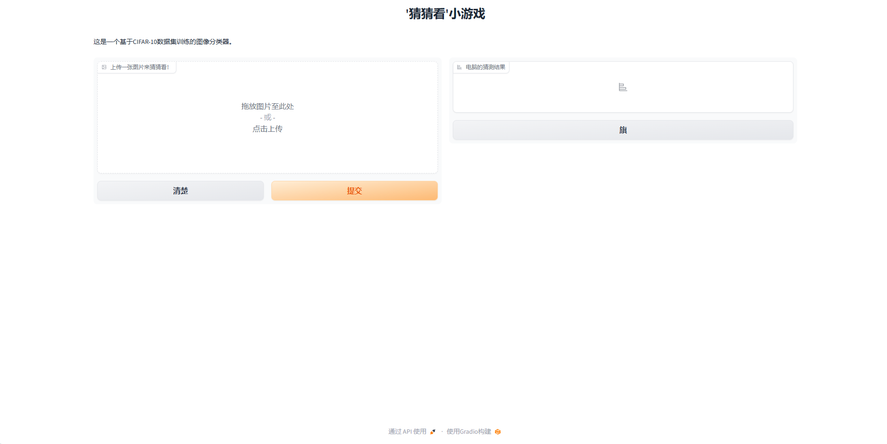
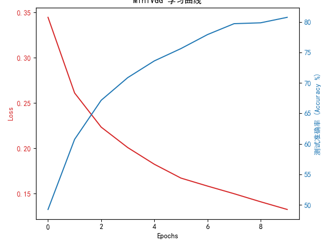
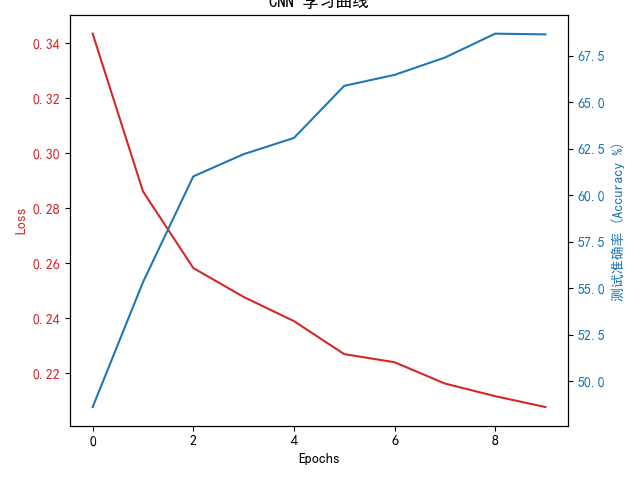
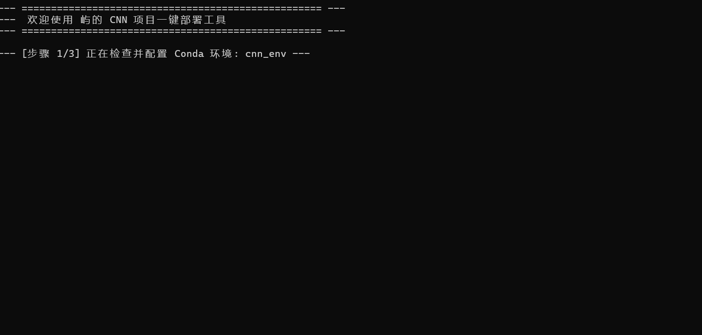

# pytorch-cifar10-classifier
# 基于PyTorch的CIFAR-10图像分类器 (PyTorch CIFAR-10 Classifier)

这是一个使用PyTorch从零开始构建的深度学习项目。项目旨在训练一个卷积神经网络（CNN），用于识别CIFAR-10数据集中的10种不同物体，并提供一个可交互的Web界面进行实时预测。

## ✨ 主要功能 (Features)

- **两种模型架构**: 包含一个自定义的`CNN`模型和一个受VGG启发的`MiniVGG`深层模型。
- **命令行驱动**: 支持通过命令行参数灵活选择模型、模式（训练/评估）和训练周期。
- **自动化脚本**: 提供一键配置环境、训练、评估和启动应用的 `.bat` 脚本，极大简化了使用流程。
- **可续训练**: 训练过程支持检查点(Checkpoint)的保存与加载，可随时中断和恢复。
- **性能可视化**: 自动绘制并保存训练过程中的损失与准确率学习曲线。
- **交互式应用**: 提供一个基于 Gradio 的Web UI，用户可以上传任意图片进行实时预测。

## 📸 效果展示 (Demo Showcase)

这里就是你放截图的地方！一张好的截图，胜过千言万语。

**1. Gradio 交互界面**
*(在这里放入你的 `app.py` 运行后的网页截图)*


**2. MiniVGG 和CNN模型学习曲线**
*(在这里放入你训练后生成的学习曲线图片)*


**3. 一键启动脚本**
*(在这里放入你运行 `.bat` 脚本的终端截图)*



## 🚀 如何使用 (Usage)

本项目推荐在 Windows 系统和 Conda 环境下使用。

### 1. 首次配置环境 (一键完成)
首次使用，请先双击运行 **`setup_environment.bat`** 脚本。

它将自动为你完成所有准备工作：
- 创建名为 `cnn_env` 的 Conda 虚拟环境。
- 安装 `requirements.txt` 中列出的所有依赖库。
- 下载并准备 CIFAR-10 数据集。

### 2. 训练新模型
进入 `scripts` 文件夹，双击对应的 `.bat` 脚本即可。例如，双击 **`训练MiniVGG.bat`** 来启动 `MiniVGG` 模型的训练。

你也可以在激活环境后，通过命令行手动运行，以进行更精细的控制：
```bash
# 激活环境
conda activate cnn_env

# 训练 MiniVGG 模型 30 个周期
python CNN.PY --model MiniVGG --mode train --epochs 30